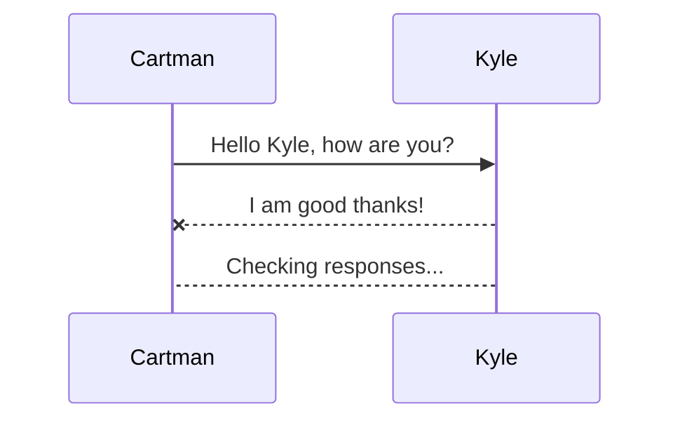
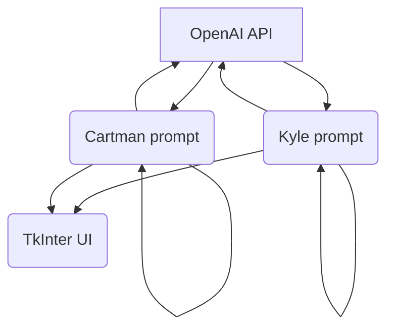

# DialogGPT: ChatGPT AI Dialogues

<div style="text-align:center">
  
</div>


This Python program uses the tkinter library to create a desktop chat interface between two AI-generated characters: Cartman and Kyle from South Park. The program fetches a conversation from the OpenAI API and displays it in a GUI while using text-to-speech to voice each character's lines. Each character's animated GIF plays only while that character is speaking, simulating a phone call between the two.

The conversation is generated by the OpenAI API using character-specific prompts defined in `data/init_prompts.py`. A test mode is also available to run the app with pre-written dialogues without consuming API credits.

> **Note:** This app runs on **Windows only** due to its dependency on `pyttsx3` with the Windows SAPI TTS backend.

## Requirements

-   Windows OS
-   Python 3.x
-   OpenAI API key with available credits

## Usage

1.  Clone the repository to your local machine.
2.  Create and activate a virtual environment:
    ```cmd
    python -m venv venv
    venv\Scripts\activate
    ```
3.  Install the dependencies:
    ```cmd
    pip install -r requirements.txt
    ```
4.  Copy `.env.example` to `.env` and fill in the values:

    | Variable | Description |
    |---|---|
    | `OPENAI_API_KEY` | Your OpenAI API key |
    | `OPENAI_NUMBER_ITERATIONS` | Number of dialogue exchanges to generate |
    | `TYPE_OF_INPUT` | `API` to generate via OpenAI, `TEST` to use pre-written dialogues |
    | `LANGUAGE` | `EN` for English, `ES` for Spanish |

5.  Run the program:
    ```cmd
    python launch.py
    ```

## Description of files

-   `launch.py`: The main file that implements the chat interface.
-   `data/*`: Contains test dialogues and prompts for the program to use.
-   `openai_api.py`: Defines the function that calls the OpenAI API to get conversation data.

## Description of code

- `ImageLabel` — custom tkinter label that displays animated GIFs with support for `pause()` and `resume()` to control animation per-character during TTS playback.
- `ChatInterface` — handles the GUI layout and the conversation flow.
  - `send_dialogue` — determines whose turn it is, pauses the silent GIF, resumes the speaking one, then runs TTS in a background thread so the UI stays responsive.
  - `print_message` — appends the current message to the text box with color-coded speaker labels.
  - `speak_message` — sets the voice and speaks the message via `pyttsx3`.
- `openai_request(language)` — generates a back-and-forth conversation between Cartman and Kyle using the OpenAI Chat API (`gpt-3.5-turbo`). It builds each character's prompt incrementally by appending the other's replies, iterating `OPENAI_NUMBER_ITERATIONS` times. Returns a dict with `sender` and `receiver` message lists.


## How it works
We have an initial prompt for both characters, which will have a brief description providing context for their personality and situation. As the conversation progresses, the prompt accumulates context from the responses and is sent in its entirety with each iteration.



And this will produce a flow chart:



## Credits

This chatbot was created by Fernando Gonzalez (nandodev) as a little experiment with the OpenAI API. Feel free to Fork or Clone the repository.